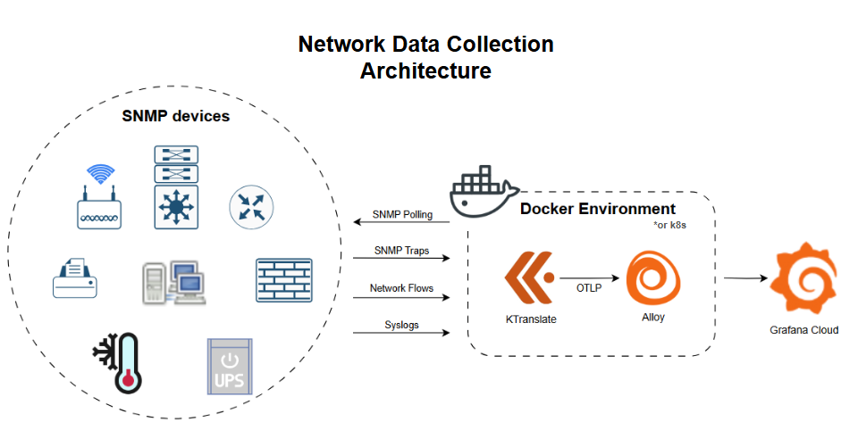
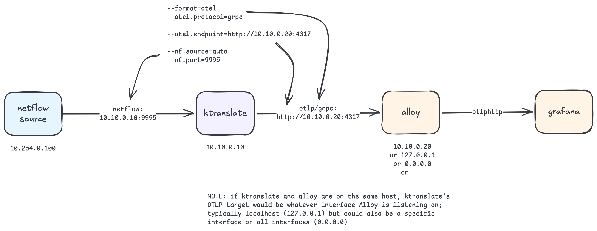

# KtransToGrafana
This repo is an example of a quick time to value deployment of [Ktranslate](https://github.com/kentik/ktranslate/) writing to a [Grafana Cloud](https://grafana.com/products/cloud/) OTLP endpoint. While there are countless approaches to accomplish this I am hoping to provide a simple, functional example without requiring too much Linux or Alloy expertise. You should be able to have SNMP data showing up in your Grafana account in about 10-15 minutes.

This repo is not maintained by Kentik or Grafana, it is just a demonstration of how to easily connect the two tools together. Questions about the example configs can be raised at this repo, bugs or feature requests for either tool should be directed at their respective repos.

If you run into problems you can check the ```troubleshooting``` folder in this repo for some more help.

## Architecture
This example deploys a small set of containers via Docker Compose:
- **`ktranslate_flow`** — receives netflow data (netflow 5/9, sflow, ipfix, nbar, pan, etc.) and converts it to OTEL metrics via configurable rollups.
- **`ktranslate_snmp_<group>`** — one long-running SNMP poller per credential group. Each reads a static config file from `config/` plus a separately-managed device list from `state/`.
- **`discover_<group>`** — one short-lived discovery container per credential group. Runs on a schedule, writes discovered devices back to `state/`, and signals the matching poller to reload.
- **`ktranslate_syslog`** — collects syslog and forwards as OTEL logs.
- **`alloy`** — a stripped-down Grafana Alloy agent that forwards all OTLP traffic from the above to Grafana Cloud.

Each credential group (e.g. `cisco`, `palo`, `fortinet`) is defined by a single declarative file in `groups/<name>.env`. A generator script reads those files and renders the per-group config yamls plus a compose service fragment. Adding a new credential group is a one-file operation followed by a re-run of the generator.

The split between discovery and polling lets git stay the source of truth for credentials, scan ranges, and polling rules, while letting the network itself be the source of truth for which devices currently exist. Discovery writes are atomic and reversible; polling configs are mounted read-only and never mutated.




## Usage Instructions

### Prerequisites
Start with an Ubuntu Linux system (also tested under Windows WSL).

Install Docker and Docker Compose per their [documentation](https://docs.docker.com/compose/install/linux/#install-using-the-repository), plus `yq` (Mike Farah's version, for the discovery script) and `envsubst` (for the generator):
```
sudo apt install yq gettext-base
```
Verify everything is in place:
```
docker run hello-world
docker compose version
yq --version
envsubst --version
```

Clone this repo into the directory where you intend to store your ktranslate deployment:
```
git clone https://github.com/Mesverrum/KtransToGrafana.git
cd KtransToGrafana/
```

### Copy the sample files
The base files (env + Alloy) are one-time copies:
```
cp .env.sample .env
cp config.alloy.sample config.alloy
```
The credential groups are managed under `groups/`. Two sample groups ship in the repo — copy whichever you want as a starting point, or both:
```
cp groups/cisco.env.sample groups/cisco.env
cp groups/palo.env.sample  groups/palo.env
```
You can delete either of these if you only need one, and you can copy additional sample files to define more groups (e.g. `cp groups/cisco.env.sample groups/fortinet.env`). The generator picks up everything matching `groups/*.env`.

### Set Grafana Cloud credentials in `.env`
Log in to your Grafana Cloud account and search for `Add new connection`, then in that screen search for `otlp` and select the `OpenTelemetry` tile. Create a new token or use an existing one. Skip past the Alloy install instructions — you don't need to deploy Alloy from there. Scroll down to `Append the generated configuration to your configuration file` and find the snippet that looks like this:
```
otelcol.exporter.otlphttp "grafana_cloud" {
    client {
        endpoint = "https://otlp-gateway-prod-abcxyz.grafana.net/otlp"
        auth     = otelcol.auth.basic.grafana_cloud.handler
    }
}

otelcol.auth.basic "grafana_cloud" {
    username = "0000000"
    password = "glc_foo="
}
```
Edit `.env` and paste the URL, username, and password into `GC_OTLP_URL`, `GC_OTLP_ACCOUNT`, and `GC_OTLP_KEY`. No quotes needed. Save the file.

You do **not** need to `export` these into your shell. Docker Compose automatically reads a file named `.env` from the directory you run it in and uses it to resolve the `${VAR}` placeholders in the compose files. The file persists across reboots and the values are picked up every time you run `docker compose`, so nothing leaks into your user environment and nothing is lost on logout. If you ever want to maintain side-by-side environments on one host (dev/staging/prod) you can keep additional files like `.env.prod` and select one at run time:
```
docker compose --env-file .env.prod -f compose-base.yaml -f compose-groups.generated.yaml up -d
```

#### Compose interpolation vs. per-service `env_file:`
There are two distinct mechanisms in Docker Compose for "loading variables from a file," and the distinction matters if you ever extend this setup:

- **Compose-level interpolation (what this repo uses)** — variables in `.env` are substituted into the compose file *at parse time*, before any container is created. They become whatever you reference them as (`environment:`, `command:`, ports, image tags, etc.). The container itself never sees `.env`; it only sees what you explicitly hand it via the `environment:` block.
- **Per-service `env_file:`** — adding `env_file: [.env]` to a service block does something different: it injects the file's contents *into that container's environment* at runtime. Use this when a container expects to read a variable it wasn't explicitly given via `environment:` — for example, a third-party image that auto-reads `MY_API_KEY` from `os.environ`. None of the containers in this repo need that, so we rely on interpolation alone, but it's worth knowing the difference if you swap in something new.

The `config.alloy` file is already wired to those env vars; you should not need to touch it unless you have non-ktranslate changes to make.

### Configure the SNMP credential groups
Each file in `groups/*.env` is one credential group. Open the file and fill in the values — every variable is documented inline in the sample. The important ones:

- **`GROUP`** — short identifier (`cisco`, `palo`, etc.). Used in container names, file paths, and the OTEL `service.name` so dashboards can split by group.
- **`SNMP_VERSION`** — `v2c` or `v3`. The other credential fields are only required for the matching version.
- **`TARGETS`** — comma-separated list of CIDRs or `/32` IPs for discovery to scan.
- **`METALISTEN_PORT` / `TRAP_PORT`** — host ports for this group. Must be unique across groups and must not collide with the static services (9995, 9996, 9998, 4317, 12346, 1514). The generator will refuse to run if it finds a collision.

When you're ready, render the configs:
```
./scripts/generate-groups.sh
```
This produces:
- `config/discovery-<group>.yaml` — the canonical discovery config the discovery script feeds to ktranslate
- `config/poller-<group>.yaml` — the polling config, with the `devices:` block pointing at `state/devices-<group>.yaml` via an `@`-include
- `compose-groups.generated.yaml` — service definitions for every group's poller and discovery container

All three are derived artifacts: they are regenerated from `groups/*.env` and the templates in `templates/` every time you run the script. **Don't hand-edit them.** If you need different rendering, edit the templates instead.

### Adding, removing, or modifying a group
Adding `groups/fortinet.env` is the whole change — no compose file edits, no script edits:
```
cp groups/cisco.env.sample groups/fortinet.env
# edit groups/fortinet.env: set GROUP=fortinet, fill creds, assign unique ports
./scripts/generate-groups.sh
docker compose -f compose-base.yaml -f compose-groups.generated.yaml up -d
./scripts/run-discovery.sh fortinet
```
`docker compose up -d` is idempotent — it starts the new services without disturbing the existing ones. Modifying or removing a group follows the same pattern (edit or delete the env file, re-run the generator, re-run `up -d`).

### Permissions
The discovery script writes files into `state/` that the containers need to be able to read. Set ownership once:
```
sudo chown -R 1000:1000 config/ state/
```

### Bootstrap the device lists
The pollers `@-include` `state/devices-<group>.yaml`, so those files must exist before the pollers start. Either run a discovery cycle first:
```
./scripts/run-discovery.sh cisco
./scripts/run-discovery.sh palo
```
Or seed empty stubs:
```
echo '{}' | tee state/devices-cisco.yaml state/devices-palo.yaml
```

### Start everything
```
docker compose -f compose-base.yaml -f compose-groups.generated.yaml up -d
```
You'll see images get pulled, then the pollers will start and begin polling whatever devices are in their respective `state/devices-*.yaml`. The `discover_*` services are gated behind a Compose profile so `up` does not start them — they only run when invoked via the discovery script.

### Schedule ongoing discovery
Add cron entries on the host so new devices get picked up automatically. Stagger each group a few minutes apart so they don't all run at once:
```
0  */6 * * * cd /opt/Grafana/KtransToGrafana && ./scripts/run-discovery.sh cisco >> /var/log/ktrans-discovery.log 2>&1
5  */6 * * * cd /opt/Grafana/KtransToGrafana && ./scripts/run-discovery.sh palo  >> /var/log/ktrans-discovery.log 2>&1
```
Each run scans the configured CIDRs, atomically publishes a fresh `state/devices-<group>.yaml`, and sends a SIGHUP to the matching poller so it picks up the new device list without a restart. If discovery returns zero devices (network blip, container crash) the script preserves the previous device list rather than wiping it. If the device list is unchanged from the previous run, no reload is sent.

## Data in Grafana
Within a couple minutes of seeing ktranslate polling your devices there should be data in your Grafana Cloud's default Prometheus data source. Metrics start with `kentik_snmp_*` and carry labels like `device_name` and `if_interface_name` based on the SNMP profile assigned during discovery. Each poller stamps its own `service.name` (`snmp-cisco`, `snmp-palo`, etc.) so you can split dashboards by credential group.

Network gear cardinality is all over the place — a UPS might emit ~50 active series, a large core switch or load balancer might emit 10,000. Plan accordingly.

Flow data is high volume, so the `ktranslate_flow` container uses the `--rollups` argument in `compose-base.yaml` to convert raw flow records into a smaller collection of metric series. This is far more cost-effective to store and query than raw flow log lines. The [Sankey panel](https://grafana.com/grafana/plugins/netsage-sankey-panel/) in Grafana works well to visualize this data after applying the `Group by` transformation to sum bytes.

JSON for example dashboards (flow summary, fleet overview, device view) is in the `dashboards/` folder — import them into your Grafana instance to get started.

# Contact me
Feel free to reach out via Issues and PRs in this repo or contact me directly, marcnetterfield@gmail.com
