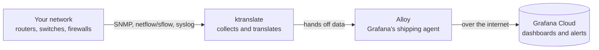

# KtransToGrafana

A quick, working example of getting your network devices monitored in [Grafana Cloud](https://grafana.com/products/cloud/) using [Ktranslate](https://github.com/kentik/ktranslate/) — no deep Linux or observability background required. Follow the quickstart below and you should have SNMP data in Grafana in about 10–15 minutes.

This repo is not maintained by Kentik or Grafana — it's a demonstration of connecting the two. Config questions can be raised here; bugs/feature requests for either tool belong in their own repos. If you get stuck, check the `troubleshooting/` folder.

## How it works

Three small pieces run as containers on one Linux host (via Docker Compose) and hand data down a line to Grafana Cloud:

- **ktranslate** — the collector. It talks to your gear the way you already do — SNMP polling, receiving netflow/sflow, and syslog — and turns what it gathers into metrics and logs.
- **Alloy** — Grafana's shipping agent. It takes what ktranslate produces and sends it up to Grafana Cloud.
- **Grafana Cloud** — where the data lands, and where you build dashboards and alerts.


```mermaid
flowchart LR
  D["Your network<br/>routers, switches, firewalls"] -->|"SNMP, netflow/sflow, syslog"| K["ktranslate<br/>collects and translates"]
  K -->|"hands off data"| A["Alloy<br/>Grafana's shipping agent"]
  A -->|"over the internet"| G[("Grafana Cloud<br/>dashboards and alerts")]
```

You give ktranslate a **subnet** and **SNMP credentials** (v2c community, v3 user, or both). Discovery tries those credentials on every address and keeps whichever one each device answers. One device is the same file with a `/32`.

## Prerequisites

An Ubuntu Linux host (also tested under Windows WSL) with Docker + Docker Compose, plus `yq` (Mike Farah's) and `envsubst`:

```
sudo apt install yq gettext-base
```

Verify:

```
docker run hello-world
docker compose version
yq --version
envsubst --version
```

## Quickstart — onboard your devices in about 15 minutes

You'll point ktranslate at a subnet and SNMP credentials; discovery works out which credential each device uses.

**1. Clone.**

```
git clone https://github.com/Mesverrum/KtransToGrafana.git
cd KtransToGrafana/
```

**2. Copy `.env` and paste your Grafana Cloud OTLP credentials** (one-time; `.env` is git-ignored so edits survive `git pull`):

```
cp .env.sample .env
```

Do **not** copy `config.alloy.sample` or `compose-base.yaml.sample` — `make up` uses them as-is. Rare forks: [architecture.md](docs/architecture.md#customizing-alloy-and-compose).

In Grafana Cloud, go to **Add new connection → OpenTelemetry (OTLP)**, create/select a token, and skip the Alloy install steps. From **that same snippet**, copy all three values into `.env` (no quotes) — they must be one stack and one region:

- `GC_OTLP_URL` ← the `endpoint` URL (`https://otlp-gateway-prod-<region>.grafana.net/otlp`)
- `GC_OTLP_ACCOUNT` ← the `username` (numeric instance ID)
- `GC_OTLP_KEY` ← the `password` (`glc_...` token)

Do not open that URL in a browser (`GET /otlp` is a 404). OTLP is `POST /otlp/v1/metrics`. Leave `KTRANS_HOST` blank and use `make up` (do not start with raw `docker compose up` while it is blank).

**3. Subnet + SNMP credentials.** Copy one file (leave it named `onboarding` — that is what `make discover` uses):

```
cp groups/onboarding.env.sample groups/onboarding.env
```

Set `TARGETS` to the CIDR(s) to scan (`10.0.0.0/24,10.10.0.0/24`, or one box as `192.168.1.1/32`). Then pick **one** of these credential blocks — discovery tries every candidate you list against every address, so you do not need a device-to-community map.

**SNMPv2c only** (one community, or several comma-separated):

```
SNMP_VERSION=v2c
SNMP_V2_COMMUNITY="public,corp-ro"
```

**SNMPv3 only** (authPriv — all five fields required):

```
SNMP_VERSION=v3
SNMP_V3_USER=netops
SNMP_V3_AUTH_PROTOCOL=SHA
SNMP_V3_AUTH_PASS=your-auth-passphrase
SNMP_V3_PRIV_PROTOCOL=AES
SNMP_V3_PRIV_PASS=your-privacy-passphrase
```

**Both** (estate with mixed v2c and v3 — the sample default). Keep `SNMP_VERSION=mixed`, fill `SNMP_V2_COMMUNITY` and the `SNMP_V3_*` block. A second v3 user is `SNMP_V3_USER_2` / `SNMP_V3_AUTH_PASS_2` / … (same five fields).

Leave `METALISTEN_PORT` / `TRAP_PORT` as they are. Copy only this one file for the first run.

**4. Generate configs:**

```
make generate
```

**5. Let the containers read/write the config + state dirs** (they run as uid 1000):

```
sudo chown -R 1000:1000 config state
```

**6. Start the stack and run discovery:**

```
make up                          # start flow, syslog, SNMP, and Alloy
make discover GROUP=onboarding   # scan the range, match credentials, hand devices to the poller
```

`make up` and `make discover` print a short `==>` line per step and keep Docker/ktranslate chatter in `state/*.log`. `VERBOSE=1 make up` restores the full dump. `make logs` still tails containers live.

`make up` prints the resolved `deployment.host` and brings everything up. Discovery writes `state/devices-onboarding.yaml` — each device stamped with the credential that worked — unions that device's `discovered_mibs` into the poller's `global.mibs_enabled` (so vendor tables are collected without editing YAML), and reloads the poller. Devices that did not answer are simply missing from that file (wrong creds, ACL, non-SNMP, or unreachable).

If a script says `Permission denied`, Git on Windows (or a zip extract) dropped execute bits. `make` already runs `bash scripts/…`; one-shot: `chmod a+x scripts/*.sh` (`make preflight` does this too).

## See your data

Import the bundled dashboards **now** — first SNMP polls take a minute or two, and the boards are the packaged view. Do not start in Explore.

In Grafana Cloud: **Dashboards → New → Import**. For each file in the repo’s `dashboards/` folder, paste the JSON (or upload the file). Start with these two so you have something to watch while the rest import:

- `dashboards/00 Ktranslate Architecture.json`
- `dashboards/03 Network Device Summary.json`

Then import the others (`01`, `02`, `04`–`10`). When Grafana asks for a data source, pick this stack’s default Prometheus (and Loki for **08 Network Events**). Open **00** or **03** and wait — panels fill as polls land. Import the whole set, not only Device Details; Summary drills into Details and Health shows the collectors.

If the dashboards are still empty after a couple of minutes, then check the hops — [troubleshooting/bring-up.md](troubleshooting/bring-up.md). This path has **no** `kentik_snmp_DeviceMetrics` series (that name is AWS `integrations/snmp`). A quick Explore query on the default Prometheus data source:

```
count by (tags_snmp_group, device_name) (kentik_snmp_CPU)
```

One row per polled device. `state/devices-onboarding.yaml` is what discovery kept. Confirm Alloy on this host (`curl -s http://localhost:12346/metrics | grep otelcol_receiver_accepted`) before chasing Grafana Cloud, then `make logs` / `snmpwalk` ([troubleshooting/snmp.md](troubleshooting/snmp.md)). More queries: [docs/grafana.md](docs/grafana.md).

Optional: instant demo flow before any router exports it — `make detect-net && make up-demo` ([operations.md](docs/operations.md#instant-flow-data-with-the-sflow-demo-overlay)).

When the boards have devices, extra setup (vendor pollers, NetBox, scheduled discovery, Kubernetes) is under [Going further](#going-further).

## Going further

The quickstart is deliberately minimal. Deeper topics live in `docs/`:

- **[docs/configuration.md](docs/configuration.md)** — extra SNMP options, NetBox, splitting a scan into vendor pollers, adding groups.
- **[docs/secrets-aws.md](docs/secrets-aws.md)** — optional SNMPv3 via AWS Secrets Manager (`SNMP_V3_SECRET=aws.sm.…`) instead of inline passphrases.
- **[docs/architecture.md](docs/architecture.md)** — what each container does, the discovery/polling split, [sizing](docs/architecture.md#sizing-rule-of-thumb), `.env` interpolation, and [customizing Alloy/Compose](docs/architecture.md#customizing-alloy-and-compose) (`compose.override.yaml`).
- **[docs/operations.md](docs/operations.md)** — permissions, memory limits, image pinning, scheduled (cron) discovery, the sflow demo overlay, tagging telemetry across multiple hosts (`KTRANS_HOST`), and the full `make` reference.
- **[docs/kubernetes.md](docs/kubernetes.md)** — same workflow on Kubernetes (`make k8s-up`). Not a fork. **Read [k8s/LIMITATIONS.md](k8s/LIMITATIONS.md) first** (ephemeral destination IPs, devices-file state, scale-up vs wide, HA).
- **[docs/grafana.md](docs/grafana.md)** — verification queries, flow rollups & cardinality, the official netflow-integration compatibility, and the bundled dashboards/alerts/skills.
- **[docs/dashboards.md](docs/dashboards.md)** — import the 00–10 set; why one Device Details board uses `has_*` hide logic; fleet Inventory / Risk / Capacity / Events / Environment / Adjacency.
- **[troubleshooting/bring-up.md](troubleshooting/bring-up.md)** — devices YAML → local Alloy `:12346` → Grafana PromQL (empty Explore, wrong metric name, two groups, blank `KTRANS_HOST`).
- **[troubleshooting/snmp.md](troubleshooting/snmp.md)** — `snmpwalk` from the Docker host.

Modifying the repo? See [CONTRIBUTING.md](CONTRIBUTING.md) for the conventions (the docs-index rule, the config generator, `.env` quoting).

# Contact me

Feel free to reach out via Issues and PRs, or directly: marcnetterfield@gmail.com
