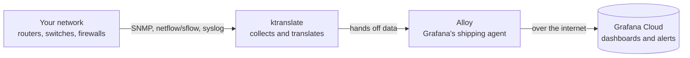

# KtransToGrafana

A quick, working example of getting your network devices monitored in [Grafana Cloud](https://grafana.com/products/cloud/) using [Ktranslate](https://github.com/kentik/ktranslate/) — no deep Linux or observability background required. Follow the quickstart below and you should have SNMP data in Grafana in about 10–15 minutes.

This repo is not maintained by Kentik or Grafana — it's a demonstration of connecting the two. Config questions can be raised here; bugs/feature requests for either tool belong in their own repos. If you get stuck, check the `troubleshooting/` folder.

## How it works

Three small pieces run as containers on one Linux host (via Docker Compose) and hand data down a line to Grafana Cloud:

- **ktranslate** — the collector. It talks to your gear the way you already do — SNMP polling, receiving netflow/sflow, and syslog — and turns what it gathers into metrics and logs.
- **Alloy** — Grafana's shipping agent. It takes what ktranslate produces and sends it up to Grafana Cloud.
- **Grafana Cloud** — where the data lands, and where you build dashboards and alerts.


```mermaid
flowchart LR
  D["Your network<br/>routers, switches, firewalls"] -->|"SNMP, netflow/sflow, syslog"| K["ktranslate<br/>collects and translates"]
  K -->|"hands off data"| A["Alloy<br/>Grafana's shipping agent"]
  A -->|"over the internet"| G[("Grafana Cloud<br/>dashboards and alerts")]
```

You tell ktranslate about your devices with one or more **credential groups** — a plain settings file per group under `groups/`, holding one set of SNMP credentials plus which devices they apply to. A group finds its devices either by scanning IP ranges you list (`cidr`) or by pulling them from NetBox. **A single device is just one group with one address** — that's the quickstart below. See [Going further](#going-further) to scale up.

## Prerequisites

An Ubuntu Linux host (also tested under Windows WSL) with Docker + Docker Compose, plus `yq` (Mike Farah's) and `envsubst`:

```
sudo apt install yq gettext-base
```

Verify:

```
docker run hello-world
docker compose version
yq --version
envsubst --version
```

## Quickstart — one device in about 10 minutes

**1. Clone.**

```
git clone https://github.com/Mesverrum/KtransToGrafana.git
cd KtransToGrafana/
```

**2. Copy the base sample files** (one-time; your copies are git-ignored so edits survive `git pull`):

```
cp .env.sample .env
cp config.alloy.sample config.alloy
cp compose-base.yaml.sample compose-base.yaml
```

**3. Add your Grafana Cloud OTLP credentials to `.env`.** In Grafana Cloud, go to **Add new connection → OpenTelemetry (OTLP)**, create/select a token, and skip the Alloy install steps. From the config snippet it shows, copy the three values into `.env` (no quotes):

- `GC_OTLP_URL` ← the `endpoint` URL
- `GC_OTLP_ACCOUNT` ← the `username` (instance ID)
- `GC_OTLP_KEY` ← the `password` (`glc_...` token)

**4. Point a group at your device.**

```
cp groups/single.env.sample groups/single.env
# edit groups/single.env: set TARGETS to your device (e.g. 192.168.1.1/32),
# SNMP_VERSION, and the community / v3 credentials.
```

**5. Generate the per-group configs:**

```
make generate
```

**6. Let the containers read/write the config + state dirs** (they run as uid 1000):

```
sudo chown -R 1000:1000 config state
```

**7. Start the stack and discover your device:**

```
make up                      # start flow, syslog, SNMP, and Alloy
make discover GROUP=single   # find the device and hand it to the poller
```

That's it — `make up` prints the resolved `deployment.host` and brings everything up. Discovery populates `state/devices-single.yaml` and reloads the poller.

## See your data

In Grafana Cloud → **Explore** → your default Prometheus data source:

```
count by (device_name, service_name) (kentik_snmp_DeviceMetrics)
```

One row per polled device means it's working. Empty after a couple minutes? Check `make logs` and confirm `snmpwalk` reaches your device from the host (`troubleshooting/snmp.md`).

Then import a dashboard from `dashboards/` (e.g. `ktranslate snmp device view`) to get a real view.

**Want flow data immediately, before any router is exporting it?** Run `make detect-net && make up-demo` to add a local sflow source. See [operations.md](docs/operations.md#instant-flow-data-with-the-sflow-demo-overlay).

## Going further

The quickstart is deliberately minimal. Deeper topics live in `docs/`:

- **[docs/configuration.md](docs/configuration.md)** — multiple groups, `DISCOVERY_SOURCE=cidr|netbox` (including NetBox filters), [onboarding a pile of devices when you don't know which credential fits which](docs/configuration.md#multiple-candidate-credentials-unknown-mapping), adding/removing groups, generator outputs, running without the Makefile.
- **[docs/architecture.md](docs/architecture.md)** — what each container does, the discovery/polling split, and how `.env` interpolation works.
- **[docs/operations.md](docs/operations.md)** — permissions, memory limits, image pinning, scheduled (cron) discovery, the sflow demo overlay, tagging telemetry across multiple hosts (`KTRANS_HOST`), and the full `make` reference.
- **[docs/grafana.md](docs/grafana.md)** — verification queries, flow rollups & cardinality, the official netflow-integration compatibility, and the bundled dashboards/alerts/skills.
- **`troubleshooting/`** — common SNMP and connectivity problems.

# Contact me

Feel free to reach out via Issues and PRs, or directly: marcnetterfield@gmail.com
