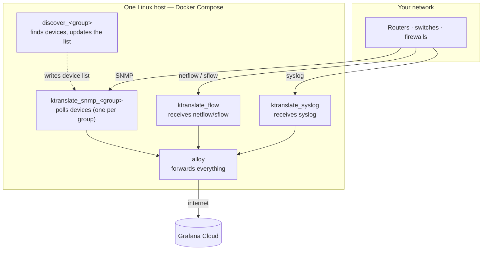
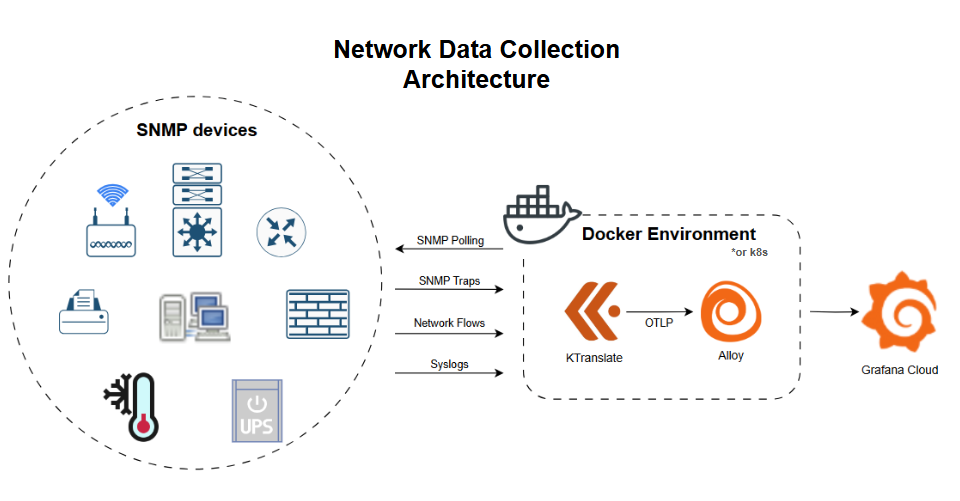
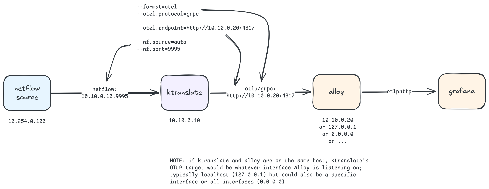

# Architecture

[← back to README](../README.md)

In plain terms: a set of small containers run on one Linux host (via Docker Compose). Each one talks to your network in a way you already know (SNMP, netflow/sflow, syslog), converts what it collects into **metrics and logs**, and hands them to a shipping agent (Alloy) that forwards everything to Grafana Cloud. "OTEL"/"OTLP" below just mean the OpenTelemetry data format — the common shape ktranslate and Alloy use so they speak the same language.

The containers:

- **`ktranslate_flow`** — receives netflow data (netflow 5/9, sflow, ipfix, nbar, pan, etc.) and converts it into metrics. Mounts the generated **device catalog** (`config/catalog.yaml`) so flow records get the same `device_name` and tags as SNMP.
- **`ktranslate_snmp_<group>`** — one long-running SNMP poller per group (`ROLE=poll` or the default `both`). Each reads a settings file from `config/` plus a separately-managed device list from `state/`. The generated poller config sets `global.user_tags.snmp_group: <GROUP>` so every SNMP series from that poller carries credential-group metadata (exported as **`tags_snmp_group`** on OTLP series in Grafana Cloud).
- **`discover_<group>`** — one short-lived discovery container per group that discovers (`ROLE=discover` or `both`). Runs on a schedule, finds devices, writes the list back to `state/`, and tells pollers to reload (`SIGUSR2`). A `ROLE=discover` group can feed several pollers via [examples/vendor-split](../examples/vendor-split/README.md) (split on vendor, site, hostname, firmware, …) instead of polling the mixed list itself.
- **`ktranslate_syslog`** — collects syslog and forwards it as logs. Uses the same device catalog as flow for consistent naming/tags.
- **`alloy`** — a small Grafana Alloy agent that forwards everything from the containers above to Grafana Cloud.

The older hand-drawn diagrams below show the same flow in more detail:

## The deployment model

A deployment is **N credential groups**, one declarative file each under `groups/<name>.env`. A generator script (`scripts/generate-groups.sh`) reads those files and renders the per-group config yamls plus a compose service fragment. Adding a credential group is a one-file operation followed by a re-run of the generator — no compose or script edits. A **single device** is just the degenerate case: one `cidr` group with one target.

Each group picks its own **`DISCOVERY_SOURCE`** (`cidr` or `netbox`), so one deployment can mix a CIDR-scanned vendor and a NetBox-sourced vendor side by side. See [configuration.md](configuration.md) for the group reference.

## Sizing (rule of thumb)

These are **field planning numbers**, not SLAs. They assume a current `kentik/ktranslate` image, default-ish poll intervals, and “average” campus/access switches — not a chassis with tens of thousands of interfaces, not 15-second polls, and not devices that sit at SNMP timeout. Size for **peak** CPU in a poll cycle (ktranslate spikes at the start of each walk); an average of 60% can hide a container that is already hitting 100%.

Budget **each ktranslate process** on its own. In this repo SNMP, flow, and syslog are already separate containers — do not spend the same 1 CPU on 500 polled devices *and* 1000 events/s.

| Workload | Starting budget | What “1 unit” covers |
| --- | --- | --- |
| SNMP polling | **1 CPU + 1 GiB RAM** | about **500** average switches / similar network devices |
| NetFlow / sFlow / IPFIX, traps, or syslog | **1 CPU + 1 GiB RAM** | about **1000 events per second** of that signal |

Worked examples:

- 1 200 access switches, SNMP only → about **3 CPU / 3 GiB** on the poller (or two groups if you want a smaller blast radius).
- 4 000 flow records/s → about **4 CPU / 4 GiB** on `ktranslate_flow`.
- Traps *and* syslog are each their own 1000 events/s column if they share a host.

What eats the SNMP budget faster than “500 devices”:

- Large interface tables (core / DC / wireless controllers)
- Short `poll_time_sec`, high `timeout_ms` / `retries`
- Extra MIBs in `mibs_enabled` (BGP, entity sensors, vendor tables)
- Devices that never answer (walks sit on timeout)

The upstream [ktranslate CPU notes](https://github.com/kentik/ktranslate/wiki/Understanding-KTranslate-CPU-Usage) quote a bit more headroom on flow/syslog (~2000 events/s per core, traps ~1000/s) and do not call out RAM. The table above is the **conservative** plan: 1000 events/s per CPU **and** 1 GiB, so you have room for OTLP export and a noisy day.

Leave **Alloy + the host OS** outside this math. Compose memory caps (`MEM_SNMP_MAX`, etc.) are documented in [operations.md](operations.md#memory-limits). On Kubernetes, raise `resources` on that one poller or add groups — do not `replicas: 2` the same listener ([k8s/LIMITATIONS.md](../k8s/LIMITATIONS.md#3-scale-up-vs-scale-wide)).

> This repo previously used separate branches for these shapes (`main` = single poller, `multicontainer_example` = per-group CIDR discovery, `multicontainer_netbox` = per-group NetBox discovery). They have all been consolidated into this one model on `main`; the old branch tips are preserved as `archive/*` tags.

## Why discovery and polling are split

The split between discovery and polling lets **git stay the source of truth** for credentials, scan ranges, and polling rules, while letting **the network itself be the source of truth** for which devices currently exist. Discovery writes are atomic and reversible; polling configs are mounted read-only and never mutated.

## Compose interpolation vs. per-service `env_file:`

There are two distinct mechanisms in Docker Compose for "loading variables from a file," and the distinction matters if you extend this setup:

- **Compose-level interpolation (what this repo uses)** — variables in `.env` are substituted into the compose file *at parse time*, before any container is created. They become whatever you reference them as (`environment:`, `command:`, ports, image tags, etc.). The container itself never sees `.env`; it only sees what you explicitly hand it via the `environment:` block.
- **Per-service `env_file:`** — adding `env_file: [.env]` to a service block injects the file's contents *into that container's environment* at runtime. Use this when a container expects to read a variable it wasn't explicitly given via `environment:` — for example, a third-party image that auto-reads `MY_API_KEY` from `os.environ`. None of the containers in this repo need that, so we rely on interpolation alone.

The `config.alloy` file is already wired to the `GC_OTLP_*` env vars; you should not need to touch it unless you have non-ktranslate changes to make. Keep the live `compose-base.yaml` Alloy volume as `source: ./config.alloy` (not a host-specific absolute path). If Grafana Explore is empty, walk the hops in [troubleshooting/bring-up.md](../troubleshooting/bring-up.md): discovery YAML → Alloy metrics on host `:12346` → PromQL `kentik_snmp_CPU` (not `kentik_snmp_DeviceMetrics`).

## Kubernetes is another runtime, not another model

`make k8s-up` applies the same generated poller/discovery/catalog YAML as Deployments, a PVC for `state/devices-*.yaml`, and a CronJob instead of host cron. Alloy still forwards to Grafana Cloud. Groups, `KTRANS_HOST`, and the dashboards do not change.

Kubernetes does **not** change the hard parts of talking to network gear (stable destination IPs, one poller per device list, UDP loss on restart). Those are called out in [k8s/LIMITATIONS.md](../k8s/LIMITATIONS.md). Operator steps: [kubernetes.md](kubernetes.md).
